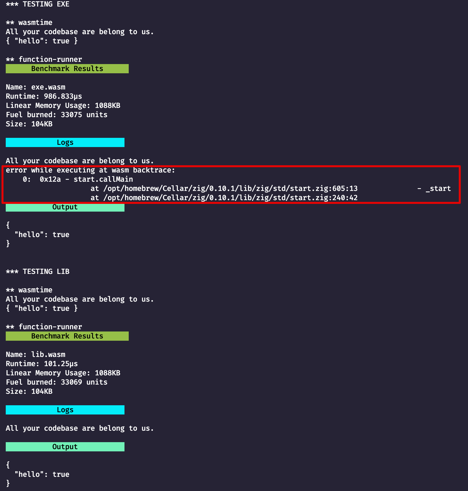

# Zig WASI Test

Tests a zig wasi module built as both an exe and a lib.

**Edit**: The main difference here turns out to be the use of exit(0) in the exe example with Zig, which is not handled gracefully by the function runner.

